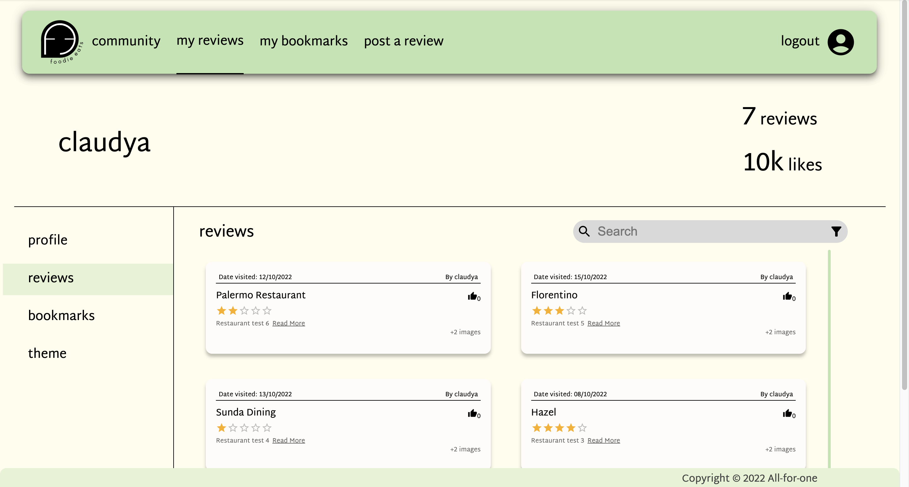
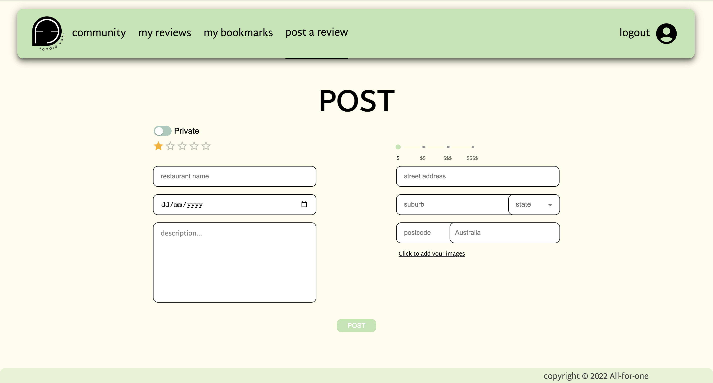
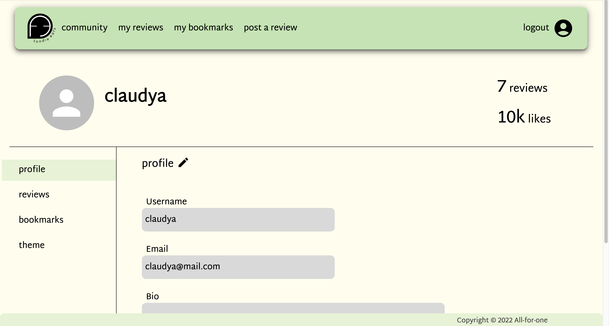

# COMP30022 IT Project

## Table of Contents

- [About our project](#about-our-project)
- [Application preview](#application-preview)
- [Built with](#built-with)
- [Run project](#run-project)
- [Run application](#run-application)
- [Api Documentation](#API-Documentation)
- [Project history](#project-history)
  - [Sprint 1](#sprint-1)
  - [Sprint 2](#sprint-2)
  - [Sprint 3](#sprint-3)
- [Test Cases](#test-cases)
- [Contributors](#contributors)

## About our project
<p align="center">
  <picture>
    
  </picture>
</p>
FoodieEats is a web application that consolidates reviews of restaurants from users, mostly for personal use. After users log in using their email and password, they are able to create reviews, view other users' reviews, and bookmark specific reviews. Users can also visit the Community page, which displays the most recent reviews and the top recommended restaurants, based on the user’s current location. As an additional feature, users are also able to choose from a list of color themes for the website.

## Application preview








## Built with

- MongoDB
- Express.js
- React
- Node.js

## Run project

1. Install Node.js and npm
2. Go to server directory ('cd server'), install dependencies ('npm install'), run server ('npm run start')
3. Go to client directory ('cd client'), install dependencies ('npm install'), run client ('npm run start')

## Run Application
Install server:
```
cd server 
npm install
cd ..
```
Install client
```
cd client
npm install
cd ..
```
Start the server:
```
cd server
npm start
cd ..
```
Start the client:
```
cd client
npm start
cd ..
```
Start both:
```
npm run dev
```
## Cypress testing
Cypress for frontend (E2E) testing is automatically run in the CI/CD through GitHub Actions.
- To run locally:
1. install server and client
     - run both server and client
     - change the SERVER_URL in 
     - add the necessary environmental variables (listed in the handover document)
     - cd into client
     - npm run cypress
      
## MochaJS Backend testing
- MochaJS for backend testing is automatically run in the CI/CD through GitHub Actions.
- To run and generate backend tests report locally (html):
    - add the necessary environmental variables (listed in the handover document), then
    cd server
    npm test-awesome -- please wait for tests to finish generating json/html report
    - report is available under server/mochawesome-report/mochawesome.html

- The final documents will be added to Confluence.
## API Documentation
- To generate the API Docs:
    - 'npm run docs' in the server directory

- To view the documentation:
    - navigate to the /docs folder and open the index.html through a browser


## Project history

### Sprint 1

- Designed logo
- Created wireframe of website using Figma
- Created Navigation Bar, Login page, Register page
- Pull users’information for Profile page
- Pull review information for Community page

### Sprint 2

- Implemented a wide range of features:
  - Login/Signup/ResetPassword
  - Create/EditReview
  - View/Edit MyProfile
  - Change Theme/Password
  - Authenticated (Private) Routes

### Sprint 3

- Focusing on CSS, unit/integration testing(MochaJS), front-end testing(Cypress)
- Implementing last few features (toggleLike/Bookmark/flag, filter/search, deletereview, upload images)

## Test Cases

- Frontend Cypress testing and backend MochaJS testing integrated in CI/CD through GitHub actions
- Cypress test cases in client/cypress
- MochaJS test cases in server/mochaawesome-report/testReport.html
  - Final MochaJS report will be added to confluence

## Contributors

| Name                     | GitHub ID   | Role                 |
| ------------------------ | ----------- | -------------------- |
| Ying Shan Saw (Celene)   | azadesuu    | Full-Stack Developer |
| Joeann Chong             | joeannc     | Front-end Developer  |
| Claudya Laurance Cahyadi | ccahyadi    | Back-end Developer   |
| Anthony Ouch             | anthonyouch | Full-Stack Developer |
| Sandeepa Andra Hennadige | Lakvinu     | Full-Stack Developer |
