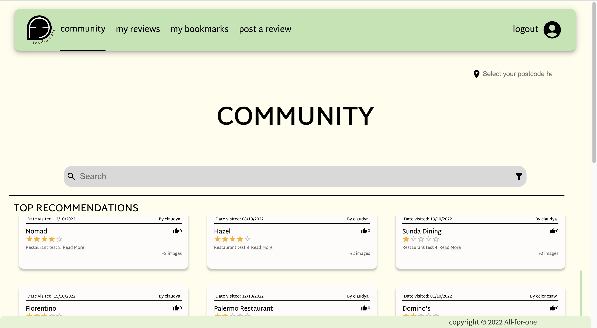

# COMP30022 IT Project

## :four_leaf_clover: Table of Contents

- [Contributors](#contributors)
- [About Our project](#about-our-project)
- [Application Preview](#application-preview)
- [Built with](#built-with)
- [Run Application](#run-application)
- [Cypress Testing](#cypress-testing)
- [MochaJS Backend Testing](#mochajs-backend-testing)
- [API Documentation](#api-documentation)
- [Project history](#project-history)
  - [Sprint 1](#sprint-1)
  - [Sprint 2](#sprint-2)
  - [Sprint 3](#sprint-3)
- [Test Cases](#test-cases)


## :open_hands: Contributors

| Name                     | GitHub ID   | Role                 |
| ------------------------ | ----------- | -------------------- |
| Ying Shan Saw (Celene)   | azadesuu    | Full-Stack Developer |
| Joeann Chong             | joeannc     | Front-end Developer  |
| Claudya Laurance Cahyadi | ccahyadi    | Back-end Developer   |
| Anthony Ouch             | anthonyouch | Full-Stack Developer |
| Sandeepa Andra Hennadige | Lakvinu     | Full-Stack Developer |


## :information_source: About Our project

<p align="center">
  <picture>
    
  </picture>
</p>

FoodieEats is a web application that consolidates reviews of restaurants from users, mostly for personal use. After users log in using their email and password, they are able to create reviews, view other users' reviews, and bookmark specific reviews. Users can also visit the Community page, which displays the most recent reviews and the top recommended restaurants, based on the user’s current location. As an additional feature, users are also able to choose from a list of color themes for the website.

## :unlock: Application Preview
<div align=center>
  
  
  
  
</div>

## :hammer: Built with

| JS             | Database  | Deployment    |
| -------------- | --------- | --------------|
| Node/Express   | MongoDB   | Cypress       |
| React          | Cloudinary| MochaJS       |
| Material UI    |           | Prettier      |
|                |           | Heroku/Netlify|

## :white_check_mark: Run Application
#### 1. Add the environmental variables stated in the Handover Document
#### 2. Change the `SERVER_URL` constant in client/api/index.js to
    `SERVER_URL = "http://localhost:5000"`
#### Then:
Install server:

```
cd server
npm install
cd ..
```

Install client

```
cd client
npm install
cd ..
```

Start the client and server:

```
npm run dev
```

## :red_circle: Cypress Testing

Cypress for frontend (E2E) testing is automatically run in the CI/CD through GitHub Actions.

- To run locally:
  - Follow the steps above to install server and client
  - Change the `SERVER_URL` constant in client/api/index.js to
    `SERVER_URL = "http://localhost:5000"`
  - add the necessary environmental variables (listed in the handover document/ in confluence)
    Then
```
    npm run dev
    cd client 
    npm run cypress
```

## :large_blue_circle: MochaJS Backend Testing

MochaJS for backend testing is automatically run in the CI/CD through GitHub Actions.

- To run and generate backend tests report locally (html):
  - add the necessary environmental variables (listed in the handover document), then

```
    cd server
    npm test-awesome
```
- please wait for tests to finish generating json/html report
- report is available under `server/mochawesome-report/mochawesome.html`

The final documents will be added to Confluence.

## :white_circle: API Documentation

- To generate the API Docs:

```
cd server
npm run docs
```

- To view the documentation:
  - navigate to the /docs folder and open the `index.html` through a browser

## :ballot_box_with_check: Test Cases

- Frontend Cypress testing and backend MochaJS testing integrated in CI/CD through GitHub actions
- Cypress test cases in client/cypress
- MochaJS test cases in server/test

## :office: Project history

### Sprint 1

- Designed logo
- Created wireframe of website using Figma
- Created Navigation Bar, Login page, Register page
- Pull users’information for Profile page
- Pull review information for Community page

### Sprint 2

- Implemented a wide range of features:
  - Login/Signup/ResetPassword
  - Create/EditReview
  - View/Edit MyProfile
  - Change Theme/Password
  - Authenticated (Private) Routes

### Sprint 3

- Implementing last few features (toggleLike/Bookmark/flag, filter/search, delete review, upload images)
- Implementing backend checks (input validation, JSON token authentication)
- CSS cleanup (changing JS alerts to MUI alerts)
- Unit/Integration testing (MochaJS), and documentation
- Front-end testing(Cypress), and documentation

